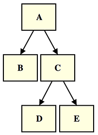
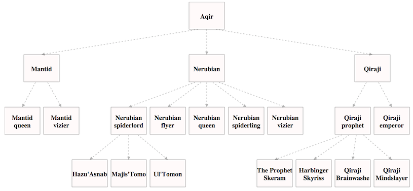
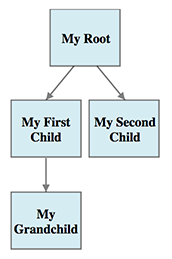
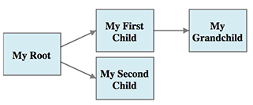
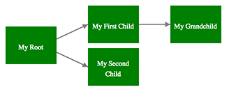
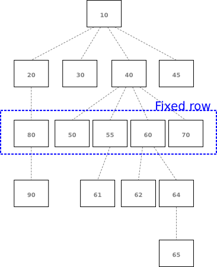
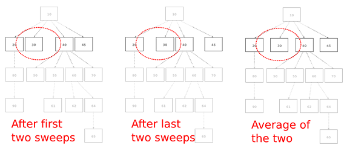

Use the 2022 version instead!
=============================

A new version delivered as an NPM package, updated for modern JavaScript (ES6) and featuring Typescript support is now available here: [treefun2](https://github.com/jimblackler/treefun2)


Legacy version
==============

[This tool][4] creates SVG (Standard Vector Graphics) files to illustrate
information structured as a basic tree.



Here I define *tree* as an ordered graph without loops where every node has zero
or one 'parent' nodes in the same tree.

It's a [very common structure][3] in computing and will be familiar to most as the
structure of folders on a personal computer (as seen in the ['Unix'
example][1]). It's also the structure of classes in a single-inheritance object
oriented programming language (as seen in the ['Java' example][2]).

However lots of real world data can be formatted this way too. For instance an
'org chart' of the hierarchy of an organization (because everyone has a boss,
apart from the boss of the company).

Project
-------

I wanted to visualize binary search trees to help understand a problem, but I
couldn't find a simple tool to take tree data as text and to output it as a line
drawing. I also became interested in the problem of arranging arbitrary tree
arrangements neatly, in the original breadthwise order, without overlapping and
with sensible spacing between elements. So, I decided to make a tree diagram
tool myself.

It may be useful as a tool to generate diagrams of tree structures for
documents, presentations and so forth, so [I've put it online][4].



The tool is written in pure JavaScript and creates SVGs that all modern browsers
can render. This means the scripts can also be dropped directly into web
applications that create tree data on the fly, as a reporting/visualization
tool. The source is freely licensed under GPL.


Use
---

To make your own diagrams all you have to do is visit one of the demo pages and
edit the data (specified in classic tabular style, e.g: 

    My Root
     My First Child
      My Grandchild
     My Second Child

This will generate the diagram below:



You can edit the options (provided as editable JSON in an edit box on the page)
to customize the image in various ways. For instance setting ```"flipXY": 1```
will convert the image to a horizontal diagram.



I won't detail all the options here because it's designed for experimentation;
just play with the values and see what you get. You can change the relative
size and margins of the nodes, line spacing in the labels, arrow size and
direction and more.

To change the colors or line styles of the nodes and arrows, or the label font
size and style, simply edit the CSS data on the page. For instance, editing the
CSS as follows...

    text {
      text-anchor: middle;
      font-size: x-small;
      fill: white;
    }

    rect {
      fill: green;
      stroke: black;
      stroke-width: 0;
    }

.. would result in this diagram:



Method
------

The diagram generator has the task of building diagrams that have elements
positioned and spaced sensibly, without nodes or lines overlapping, and making
the best use of available space (the nominated rectangle the diagram may
occupy). Element positions need to be considered as a whole, as repositioning
any element will have a knock-on effect on any other elements it might now
overlap, free space to better position, and so on.

After experimentation I developed a relatively simple method with all nodes
having their vertical position fixed in a *level* based on the distance to their
tree root. The horizontal positions are in order of the breath order of the
nodes in the tree, but other than that, they are allowed to move horizontally.
The method relies on identifying the one level which has least potential to be
repositioned, laying this out with regular spacing and fitting the other levels
around it.

Relative values are given in the options for the widths of nodes and the spaces
between sibling nodes (nodes that share the same parent) and cousin nodes (nodes
that are the same distance from their roots but don't share the same parent).

* The tree structure is converted into an array of levels.

* Each level is measured for its minimum width given the spacing ratios in the
  options.

* The level that occupies the most screen width is nominated as the *fixed*
  level.



* All levels between the fixed level up to an including the root are now
  considered in turn. For nodes that have children (in the level below) they are
  given an ideal horizontal position as the average (horizontally) of their
  children.

  A 'sweep' process then travels left to right across the nodes and forcing the
  rightmost node of each considered pair further right to ensure that it is not
  positioned too closely to its predecessor. As this may push nodes outside the
  diagram area, a return sweep performs the same operation from right to left
  with the rightmost element constrained to the available horizontal space.

  These positions won't result in overlapping elements. However because of the
  way the sweep operates, elements will often result in nodes positioned
  immediately to the right of neighbours when there is a large gap remaining
  that could be occupied. In order to have nodes occupy the central position in
  the available space, a third and fourth sweep are performed in mirror-image of
  the first two (right to left then left to right). Naturally after sweep four
  the elements are often positioned immediately to the *left* of neighbours. So,
  the positions after sweep two and sweep four are averaged to determine the
  final position of the nodes; non- overlapping and evenly positioned in the
  available space.
  


* A similar operation is performed on all the levels below the fixed level
  travelling downwards. On this occasion, the ideal horizontal position for the
  nodes is an even distribution of children underneath, with the group centered
  on their parent node.

Contact
-------

I hope some find the tool useful or interesting. [Check out the site][4] and as
ever, feel free to contact me at jimblackler@gmail.com.


[1]: http://jimblackler.net/treefun/index.html?data=unix
[2]: http://jimblackler.net/treefun/index.html?data=java
[3]: http://en.wikipedia.org/wiki/Tree_(data_structure)
[4]: http://jimblackler.net/treefun/index.html
